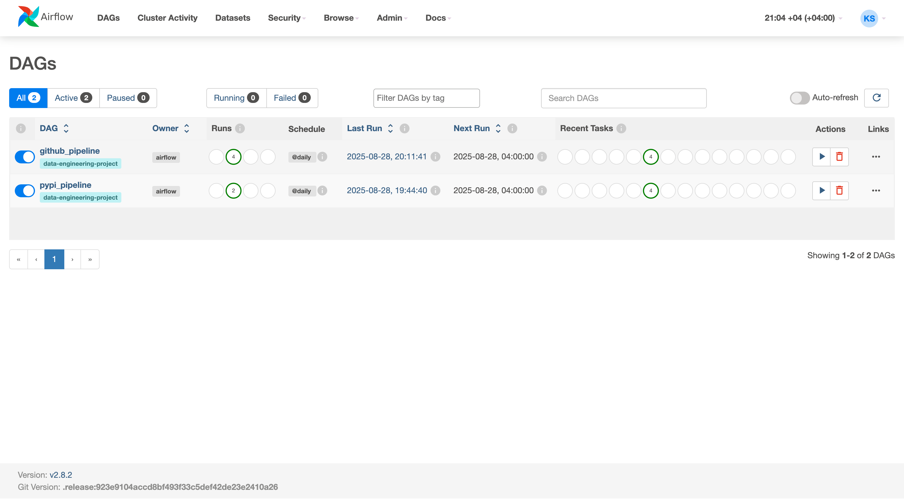
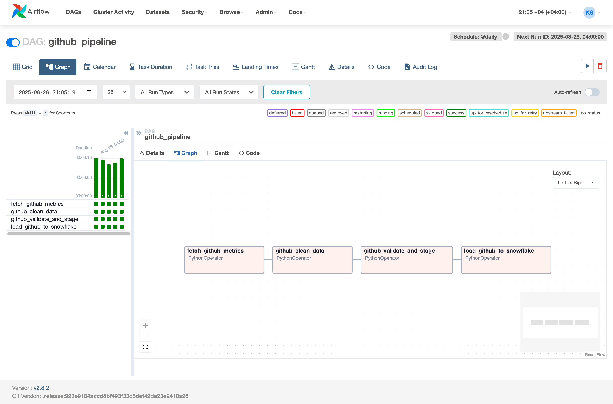

# Turbo Octo Guide

An **Apache Airflow** project for orchestrating **data pipelines** that collect, clean, validate, and load data from GitHub and PyPI into **Snowflake**.  
The project runs inside Docker containers with Airflow + Postgres, and includes automated testing + CI/CD via GitHub Actions.

## Features

- **Data Collection**  
  Collects raw data from external APIs (GitHub, PyPI).

- **Data Cleaning & Validation**  
  Ensures data quality before further processing.

- **Staging & Storage**   
  Writes intermediate data as JSON and Parquet files.

- **Loading to Snowflake**  
  Pushes transformed data into Snowflake tables using `SnowflakeHook`.

- **Fully Containerized**   
  Runs with Docker + Docker Compose (Airflow + Postgres).

- **Automated Tests**   
  Pytest-based unit tests for collectors, cleaners, validators, and loaders.

- **CI/CD**  
  GitHub Actions workflow runs tests on each push/pull request.

---

## Setup

### Prerequisites
- [Docker](https://docs.docker.com/get-docker/)
- [Docker Compose](https://docs.docker.com/compose/)

### Build & Start Airflow

```
docker compose up --build
```

Airflow UI -> http://localhost:8080

Login: admin / admin (default from airflow-init service).

### Airflow Variables

`variables.json` file in project root.
Import via Airflow UI -> Admin -> Variables -> Import Variables.

### Airflow Connection

Add a Snowflake connection in Airflow UI -> Admin -> Connections.  

Conn ID: `snowflake_default`  
Type: `Snowflake`  

Set crenentials (account, user, password, warehouse, database, schema).

### Running Tests

Tests live in the `tests/` directory.
Run them locally with:

```
docker compose exec airflow-webserver pytest -v tests/
```

---

## CI/CD with GitHub Actions

The workflow in `.github/workflows/main.yaml`.  
Runs pytest on every push to main. 
Builds the Docker environment.  
Add secrets in GitHub repo settings for SECRET_GITHUB_TOKEN and AIRFLOW_UID.

---

## Pipelines Overview

- GitHub Pipeline (`dags/github_pipeline.py`)
Collects GitHub repository metrics -> cleans -> validates -> stages as Parquet -> loads to Snowflake.

- PyPI Pipeline (`dags/pypi_pipeline.py`)
Collects PyPI package downloads -> cleans -> validates -> stages as Parquet -> loads to Snowflake.

---

## Useful Commands

Rebuild containers after code changes:
```
docker compose up --build -d
```

Stop environment:
```
docker compose down -v
```

## Screenshots


